<div align="center">
  

  <h1>Foysal Ahammad</h1>

  

  <p>
    
    
    
  </p>
</div>

---

## 📌 right now

| Focus | Status |
|:--|:--|
| 🔥 **Agent 24** | **Primary build** — autonomous AI assistant for Android: chat, plan, run tools, terminal, code editor, device control. |
| 🎮 **Game Hacking · Lua** | 🟡 **Coming soon** — script collection in the lab right now. |
| 🔁 **WiFi Repeater** | ✅ **Shipped** — v1.0.0 firmware [released](https://github.com/FoysalAhammad/WiFi-Repeater/releases/tag/v1.0.0). |

---

## 🛠️ tech stack

```txt
$ ls ~/skills
```

<p align="center">
  
  
  
  
</p>

<p align="center">
  
  
  
  
</p>

<p align="center">
  
  
  
  
  
</p>

---

## 🧩 featured projects

<table>
  <tr>
    <td width="34%" align="center" valign="top">
      <h3>🤖 Agent 24</h3>
      <p><i>main project</i></p>
      <p>Autonomous AI coding &amp; technical assistant for Android — chat, plan, run tools, terminal, code editor and device control in one app.</p>
      <p><code>Android</code> <code>AI agent</code> <code>tools</code> <code>terminal</code></p>
      <a href="https://github.com/FoysalAhammad/agent24">
        
      </a>
    </td>
    <td width="33%" align="center" valign="top">
      <h3>🔁 WiFi Repeater</h3>
      <p><i>firmware · released</i></p>
      <p>ESP32 NAT range extender with a hardened web panel, JSON status API and mDNS. Pre-built <code>.bin</code> shipped as a GitHub Release.</p>
      <p><code>ESP32</code> <code>NAPT</code> <code>firmware</code></p>
      <a href="https://github.com/FoysalAhammad/WiFi-Repeater">
        
      </a>
      <a href="https://github.com/FoysalAhammad/WiFi-Repeater/releases/tag/v1.0.0">
        
      </a>
    </td>
    <td width="33%" align="center" valign="top">
      <h3>🎮 Game Hacking · Lua</h3>
      <p><i>wip</i></p>
      <p>Script collection for game automation and modding — currently in the lab.</p>
      <p><code>Lua</code> <code>WIP</code></p>
      
    </td>
  </tr>
</table>

---

## 📊 stats

<p align="center">
  
</p>

<p align="center">
  
</p>

---

## ⚡ quote

```txt
$ cat motto.txt
I build what I imagine.
```

---

## 📡 contact

<!-- TODO: swap the 4 placeholder values below for your real handles -->
<p align="center">
  <a href="mailto:you@example.com">
    
  </a>
  <a href="https://linkedin.com/in/your-handle" target="_blank" rel="noopener">
    
  </a>
  <a href="https://x.com/your-handle" target="_blank" rel="noopener">
    
  </a>
  <a href="https://your-domain.com" target="_blank" rel="noopener">
    
  </a>
  <a href="https://github.com/FoysalAhammad" target="_blank" rel="noopener">
    
  </a>
</p>

---

<div align="center">
  <br>
  <p>
    
    
  </p>
  <sub><b>Foysal Ahammad</b> · terminal-cyberpunk profile · © 2026</sub>
</div>
